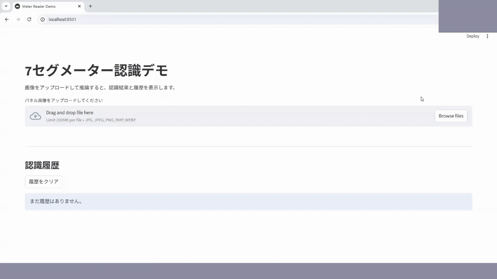

# image-recognition-app

7セグメント表示のパネル画像から機械学習によって数値を認識するプロジェクトです。  
画像処理による桁領域抽出と、PyTorchで学習したCNNの学習モデルを用いて数値を認識します。

本プロジェクトは以下の3つの実行方法に対応しています。

- CLIによる画像推論
- FastAPIによる推論API
- StreamlitによるWeb GUI

---

## 概要

本プロジェクトでは、パネル領域を切り出した画像を入力として、以下の流れで数値認識を行います。

1. 入力画像を `400x100` にリサイズ
2. 画像処理ベースで各桁領域を抽出
   - 通常(撮影環境の変化がない)の画像は、「CLAHE(クリップ制限付きヒストグラム平坦化) + 大津の二値化(判別分析法)」による前処理をおこなう
   - 照明ムラなどの撮影環境の変化に対しては、必要に応じて「適応的二値化」による前処理をおこなう
   - 輪郭抽出による桁領域検出
3. 各桁画像を `28x28` グレースケール画像に変換
4. PyTorchで学習したCNNモデルで各桁を分類
5. 左から順に数字を結合し、最終的な数値列を出力

現在は**パネル領域を事前に切り出した画像**を前提としています。
今後の拡張として、YOLOなどによる物体検出でパネル領域の自動検出などを追加することも検討しています。

---

## 想定ユースケース

- 設備メーターの自動読み取り
- 点検作業の省力化
- 監視システムの前処理
- 7セグメント表示OCRのプロトタイプ

---

##デモ動画



---

## ディレクトリ構成

```text
image-recognition-app/
├─ pyproject.toml
├─ README.md
├─ requirements.txt
│
├─ src/
│  └─ meter_reader/
│      ├─ __init__.py
│      ├─ digit_detect.py
│      ├─ recognize_torch.py
│      └─ pipeline.py
│
├─ api/
│  └─ main.py
│
├─ cli/
│  └─ meter_cli.py
│
├─ ui/
│  └─ streamlit_app.py
│
├─ training/
│  └─ train_model.py
│
├─ models/
│  └─ model_330.pth
|  └─ model_3300.pth
│
└─ assets/
   └─ samples/
       └─ ...
